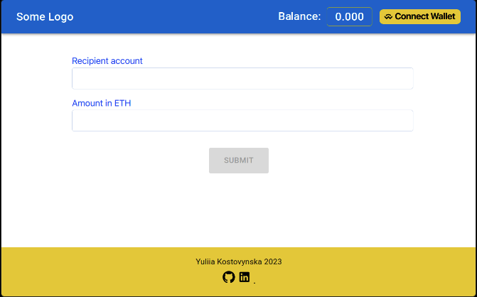

# My wallet ethereum
SPA application for connecting and checking the wallet, and making transactions from your account to any other.
To connect the wallet, you need to have the [Metamask](https://chrome.google.com/webstore/detail/metamask/) Chrome extension installed. 
You can connect via desktop or mobile application with QR code. When you connect the wallet, you will see your current balance. Using the form, you can enter the address of any wallet, enter the amount and make a transaction. Then confirm or cancel the transfer in the Metamask app


<span>

</span>

### Project built using:
- [Web3Modal](https://docs.walletconnect.com/2.0/web3modal/about)
- [React]()
- [Material UI](https://mui.com/material-ui/getting-started/installation/)
- [ReactFormik](https://formik.org/)
- [Ethers](https://docs.ethers.org/v6/)
- [MetaMask](https://docs.metamask.io/)

## Getting Started
1. Clone this repository:

```bash
git clone https://github.com/Tinkkid/wallet-ethereum
```

2. Install all dependencies:

```bash
npm install
```
3. Setup the necessary environment variables in the .env file. You need use variables for projectID from [WalletConnect](https://cloud.walletconnect.com/sign-in)

4. Start project: write command

```bash
npm run dev
```

7. Open [http://localhost:5173](http://localhost:5173) with your browser to see the result.

## Live page
Open page - use link [Wallet-Ethereum](https://wallet-ethereum.vercel.app/)
